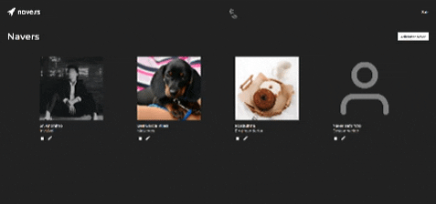
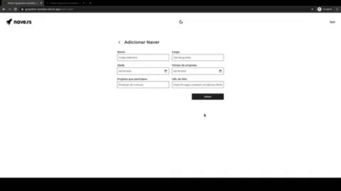
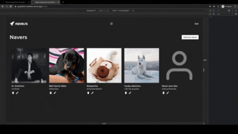

# Desafio de frontend da [Nave](https://nave.rs/)

## Rodando a aplicação
#### Localmente
	$ yarn install
	$ yarn dev 

  Acessar [http://localhost:3000](http://localhost:3000)

#### Hospedada

  Testar a [aplicação](https://guipolive-navedex.vercel.app/login) hospedada na Vercel

- Utilizar login e senha para testes:
    - testing-user-new@nave.rs
    - 1234nave5
- Ou clicar no botão de `Entrar como usuário público`.
## Sobre o desafio

O sistema consiste em uma web app para visualização e criação dos `Navers`, possuindo informações como nome, idade, cargo, tempo de empresa e projetos que participou.

## Funcionalidades

- ### Login

    O web app possui um fluxo de autenticação, onde o usuário só pode acessar as telas internas do sistema (listagem, formulários) passando pela tela de login com as credenciais aceitas.

- ### Visualização de dados
    É possível visualizar os `naver's` na `home` e ao clicar em cima da imagem de um `naver` na `home`. 

- ### Edição de dados
    É possível alterar os dados de um `naver` ao clicar no ícone de edição na `home` ou a partir da modal de visualização de um `naver`.

- ### Criação de dados
    É possível criar um `naver` a partir do botão da tela inicial: `Adicionar naver`.

## Sobre o desenvolvimento
O desenvolvimento da aplicação foi feito utilizando `Typescript`, `React.JS` e `Next.js`.

Para a integração com a API foi utilizado o `Axios` .

Alguns elementos foram convertidos em ```componentes react``` para reutilização e aproveitamento de código.

## Funcionalidades extras
- `Tema escuro!`
  - Tema escuro guardado no ```localStorage``` do navegador	

- `SWR`

- `Responsividade`

- Redirecionamento automático para ```/``` caso o usuário não esteja logado e tente acessar alguma rota que exija login.
- Sessão guardada nos `cookies` do navegador.